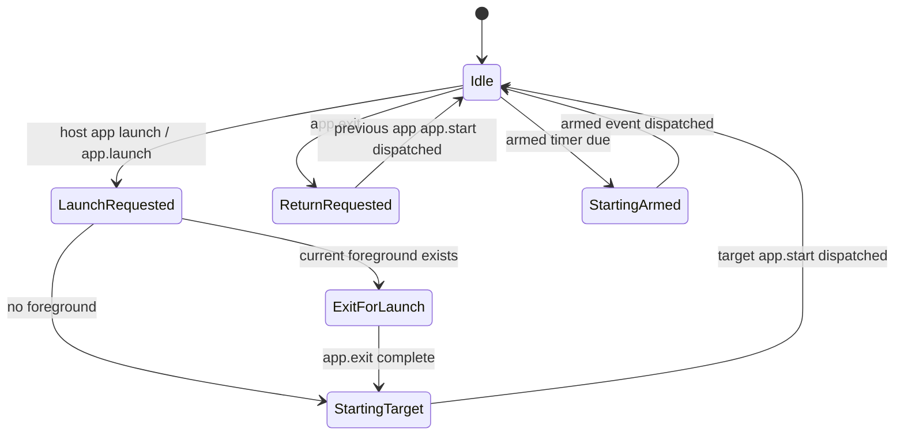
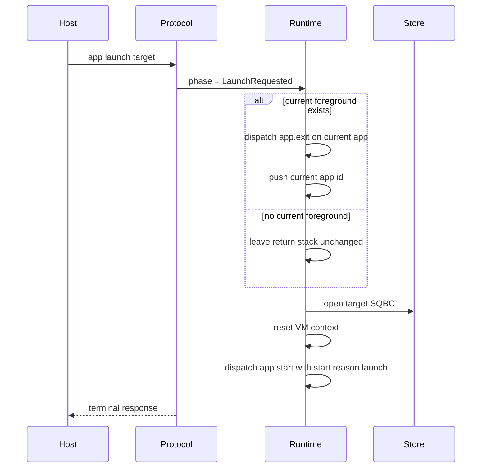
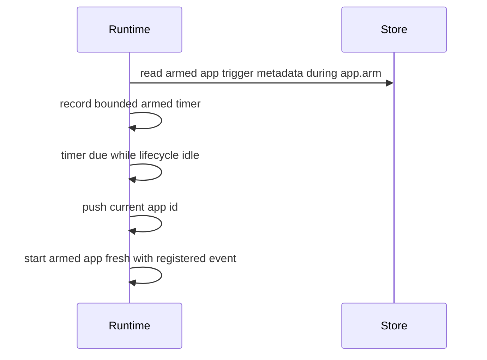

# App Lifecycle State Machine

This document defines the firmware lifecycle model for foreground SquidScript
apps. It describes the portable contract and the native firmware state machine
used by the device protocol, app store, and hardware harnesses.

## Concepts

- The active foreground app is the only app with a live VM session.
- The logical root app id is `main`. If installed `main` is absent and the
  target provides a built-in fallback app, fallback `main` is used only as the
  logical root.
- The process stack stores up to two installed foreground app ids that should
  be restarted when the foreground app calls `app.exit`. A temp-run app is
  never retained as a return target because its SQBC can be replaced.
- A lifecycle handoff starts a fresh VM session and dispatches `app.start` or
  the armed trigger event. Non-lifecycle foreground events reuse the current VM
  session.
- `app.arm` and `app.disarm` update bounded trigger registrations. Trigger
  metadata is read from installed SQBC through a reader separate from the
  active foreground reader.
- `system.startReason()` reports `"boot"`, `"launch"`, `"return"`, or
  `"wake"` for the newly started foreground session.
- Native lifecycle transition decisions live in the firmware-core
  `ForegroundLifecycle` state machine. The X4 integration supplies persistent
  app storage and routes protocol and physical input producers into it.

## Foreground State Machine

## Transitions

| Trigger | Required state | Actions | Next foreground |
| --- | --- | --- | --- |
| Host `app launch <id>` with no current app | Idle | Set start reason `"launch"` and start `<id>` fresh. | `<id>` |
| Host `app launch <id>` with current app | Idle | Dispatch current `app.exit`, push current app id, set start reason `"launch"`, start `<id>` fresh. | `<id>` |
| Host `app run <source>` | Idle or current app | Stage temp SQBC, reset volatile temp state, then use the same lifecycle launch chain as host `app launch`. A current installed app may be retained as a return target; a current temp app is replaced without being pushed. | temp app id |
| In-app `app.launch(id)` | Current VM event | Queue the same handoff used by host `app launch`. A second lifecycle request before the first drains fails the dispatch and does not leave a pending handoff. | `id` |
| In-app `app.arm(id)` | Current VM event | Queue trigger metadata registration for `id`. This may coexist with a foreground launch request. | unchanged |
| In-app `app.exit()` | Current VM event | Pop the process stack. If empty, use logical `main`. Set start reason `"return"` and start that app fresh. | popped app or `main` |
| Due event for current foreground app | Idle | Dispatch the event on the current VM session without changing the return stack or start reason. | unchanged |
| Due event for another app | Idle | Push current app id, set start reason `"launch"`, start the target app fresh with the registered event. | target app |

## Failure Cases

- Return stack overflow rejects the lifecycle transition before dispatching
  `app.exit`; the foreground app, stack, and lifecycle phase remain unchanged.
- A missing requested installed app fails the launch and must be visible through
  protocol diagnostics; fallback `main` is used only for logical root `main`,
  not to hide a missing requested foreground app.
- If the firmware cannot start the `app.exit` handoff dispatch, the target
  launch is not started. Once the handoff dispatch reaches a terminal VM
  result, the lifecycle continues to the target app so apps without an
  `app.exit` handler do not wedge host/app launches.
- Armed input ownership is exclusive. A conflicting arm keeps the existing
  owner, fails the new arm, and records a diagnostic.
- The shared eight-entry event queue drops the newest event on overflow, keeps
  existing order, and retains an overflow diagnostic.

## Diagnostics

`device lifecycle` reports the visible app routing state:

- `active=<app-id>` for the active foreground app.
- `process_stack[n]=<app-id>` for return targets.
- `armed_stack[n]=<app-id> <event>` for registered armed triggers.
- `lifecycle=<phase>` for the foreground lifecycle phase.
- `start_reason=<reason>` for the reason the current foreground app was
  started.
- `event_queue=<depth> overflow=<0|1>` for queued producer work and retained
  overflow state.

## Host Launch Sequence

## Armed Timer Sequence

## Test Isolation

Use `device reset` when a test needs to clear runtime lifecycle state while
leaving installed app storage intact. Use `device storage-format` when the
installed app registry, app files, state files, or planned-resume records must
also be cleared. Repeated host launches are lifecycle operations; they grow or
consume the process stack according to the same rules as app-driven
`app.launch`, so tests that need independent launches must reset lifecycle
state explicitly.
