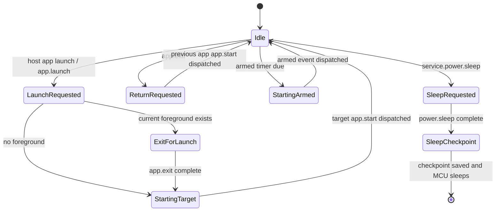
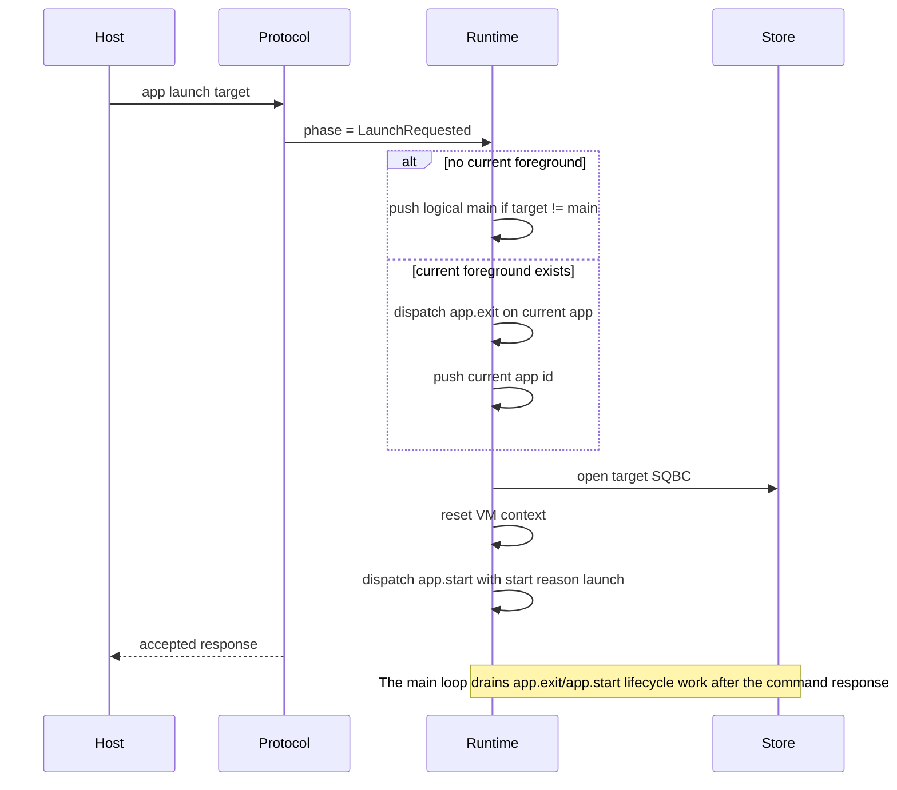
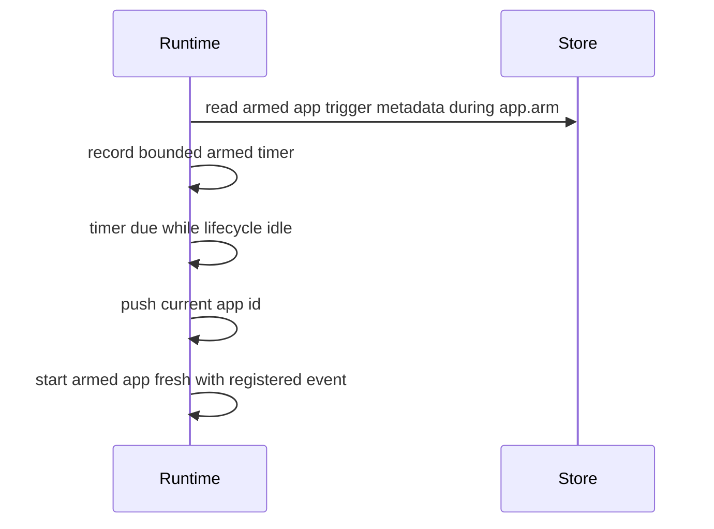
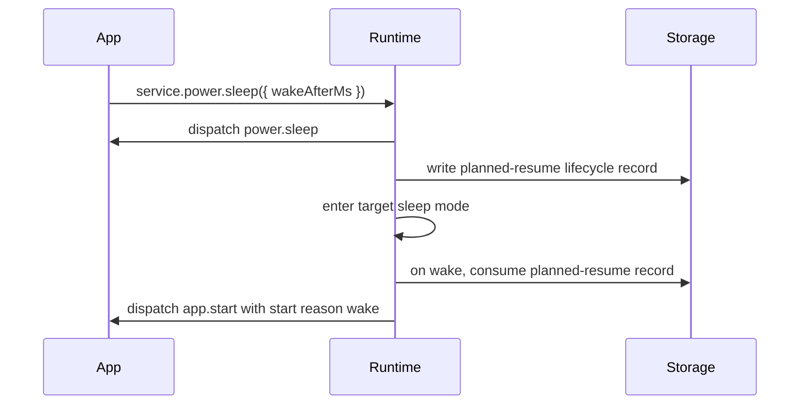

# App Lifecycle State Machine

This document defines the firmware lifecycle model for foreground SquidScript
apps. It describes the portable contract and the current Zephyr implementation
shape used by the device protocol, app store, and hardware harnesses.

## Concepts

- The active foreground app is the only app with a live VM session.
- The logical root app id is `main`. If installed `main` is absent and the
  target provides a built-in fallback app, fallback `main` is used only as the
  logical root.
- The process stack stores foreground app ids that should be restarted when the
  foreground app calls `app.exit`. Temp-run app ids may appear in the live
  process stack but are volatile and are not persisted for planned resume.
- A lifecycle handoff starts a fresh VM session and dispatches `app.start` or
  the armed trigger event. Non-lifecycle foreground events reuse the current VM
  session.
- `app.arm` and `app.disarm` update trigger registrations. They are coordinated
  by firmware lifecycle polling, but they are not foreground handoffs and may be
  queued in the same event as `app.launch`.
- `system.startReason()` reports `"boot"`, `"launch"`, `"return"`, or
  `"wake"` for the newly started foreground session.
- Zephyr lifecycle transition decisions live in `app_lifecycle.c`. Device
  protocol code performs target/storage effects requested by the lifecycle step,
  such as opening SQBC, dispatching an event, writing planned-resume records, or
  registering armed triggers.

## Foreground State Machine

## Transitions

| Trigger | Required state | Actions | Next foreground |
| --- | --- | --- | --- |
| Host `app launch <id>` with no current app | Idle | Use logical `main` as the return target, set start reason `"launch"`, start `<id>` fresh. | `<id>` |
| Host `app launch <id>` with current app | Idle | Dispatch current `app.exit`, push current app id, set start reason `"launch"`, start `<id>` fresh. | `<id>` |
| Host `app run <source>` | Idle or current app | Stage temp SQBC, reset volatile temp state, then use the same lifecycle launch chain as host `app launch`. Foreground key and timer events dispatch through the temp backend while it is current. | temp app id |
| In-app `app.launch(id)` | Current VM event | Queue the same handoff used by host `app launch`. A second lifecycle request before the first drains fails the dispatch and does not leave a pending handoff. | `id` |
| In-app `app.arm(id)` | Current VM event | Queue trigger metadata registration for `id`. This may coexist with a foreground launch request. | unchanged |
| In-app `app.exit()` | Current VM event | Pop the process stack. If empty, use logical `main`. Set start reason `"return"` and start that app fresh. | popped app or `main` |
| Armed timer due | Idle | Push current app id, set start reason `"launch"`, start the armed app fresh with the registered event. | armed app |
| `service.power.sleep({ wakeAfterMs })` | Current VM event | Queue `power.sleep`, then write the planned-resume lifecycle record after that event completes. | unchanged before sleep |
| Planned wake restore | Boot policy | Restore active app id, process stack app ids, and armed app ids; set start reason `"wake"` and dispatch `app.start`. | restored active app |

## Failure Cases

- Return stack overflow fails the lifecycle transition with `-ENOSPC`.
- A missing requested installed app fails the launch and must be visible through
  protocol diagnostics; fallback `main` is used only for logical root `main`,
  not to hide a missing requested foreground app.
- If the firmware cannot start the `app.exit` handoff dispatch, the target
  launch is not started. Once the handoff dispatch reaches a terminal VM
  result, the lifecycle continues to the target app so apps without an
  `app.exit` handler do not wedge host/app launches.
- If planned sleep checkpoint writing fails, firmware records a diagnostic and
  does not treat the lifecycle record as valid.
- Planned sleep is rejected for temp foreground apps because temp SQBC is staged
  in a replaceable slot and cannot be restored after boot.
- If planned wake restore cannot start the recorded active app, firmware records
  `planned resume app missing` and returns to normal root-start behavior.

## Diagnostics

`device lifecycle` reports the visible app routing state:

- `active=<app-id>` for the active foreground app.
- `process_stack[n]=<app-id>` for return targets.
- `armed_stack[n]=<app-id> <event>` for registered armed triggers.
- `lifecycle=<phase>` for the foreground lifecycle phase.
- `arm_lifecycle=<phase>` for pending armed-trigger registration.
- `start_reason=<reason>` for the reason the current foreground app was
  started.

## Host Launch Sequence

## Armed Timer Sequence

## Planned Sleep Sequence

## Test Isolation

Use `device reset` when a test needs to clear runtime lifecycle state while
leaving installed app storage intact. Use `device storage-format` when the
installed app registry, app files, state files, or planned-resume records must
also be cleared. Repeated host launches are lifecycle operations; they grow or
consume the process stack according to the same rules as app-driven
`app.launch`, so tests that need independent launches must reset lifecycle
state explicitly.
