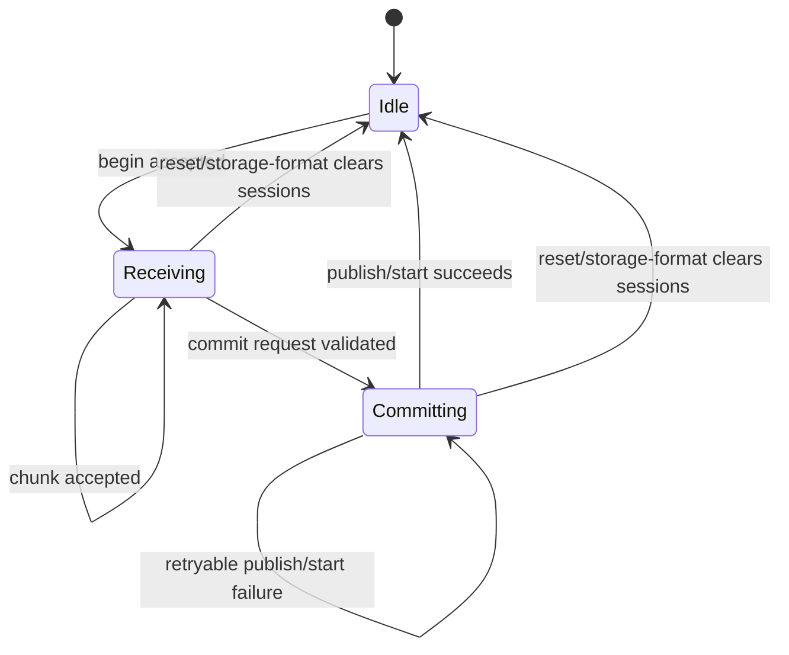
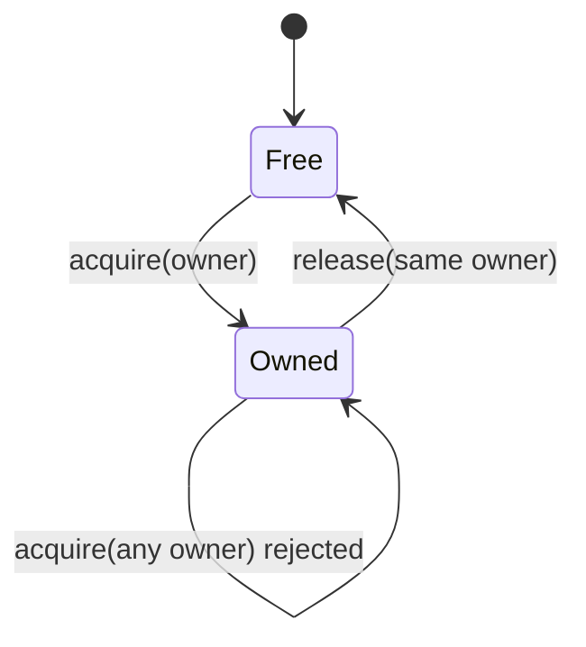
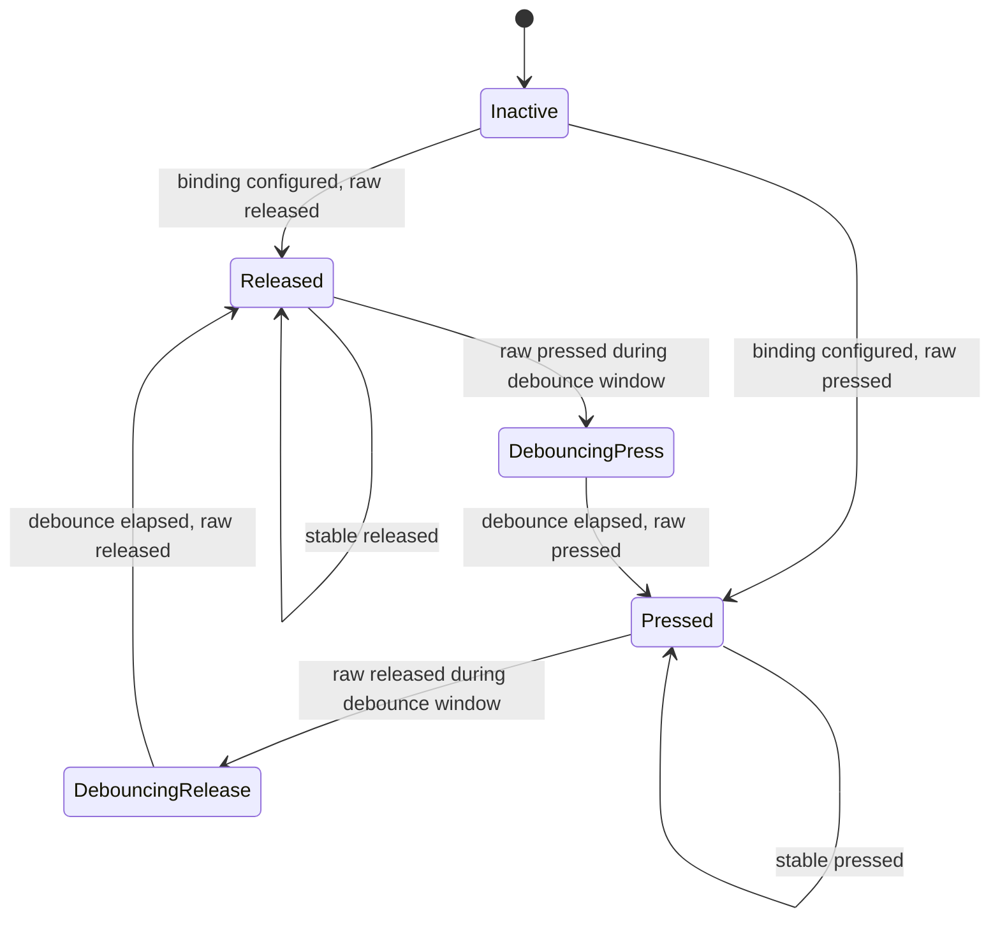
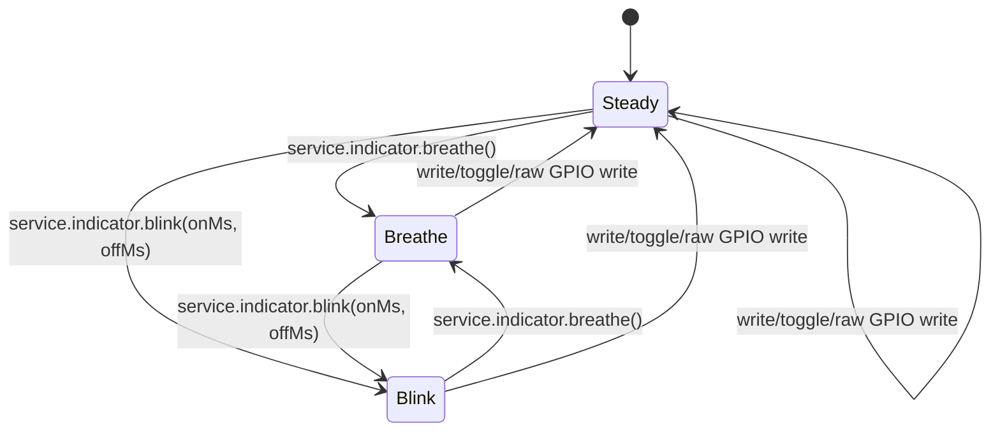

# Firmware State Machines

This document describes explicit firmware state machines that support
SquidScript runtime and device-protocol behavior. The app foreground lifecycle
is defined separately in `docs/app_lifecycle_state_machine.md`; this document
covers lower-level firmware states that must remain observable, bounded, and
testable.

## Protocol Transfer Sessions

Installed app uploads, temporary app runs, and resource uploads use the same
session phases. The wire protocol remains begin/chunk/commit. Rust FFI helpers
validate TLV fields, lengths, offsets, CRC32, and commit readiness; Zephyr C
advances the explicit phase only after the corresponding storage operation has
been accepted.

Phase rules:

- `Idle` means no transfer is active.
- `Receiving` means begin was accepted and chunks may advance byte progress.
- `Committing` means the session has passed commit validation and is attempting
  the target action: publish installed SQBC, start a temp SQBC, or publish a
  resource file.
- Reset and storage-format paths clear active sessions back to `Idle`.
- The phase is firmware-local state. It does not change SQDP frame fields or
  host-visible upload chunk sizing.

## Protocol Scratch Ownership

Protocol scratch is a single bounded work area shared by maintenance commands
that need resumable progress. Scratch users must acquire ownership before
writing command-specific state and release the same owner when work completes
or is cancelled.

Ownership rules:

- Scratch can be acquired only while it is free.
- No owner can overlap an active scratch owner.
- A mismatched release is rejected and leaves the current owner intact.
- Runtime reset and storage-format cleanup paths release scratch before they
  begin new protocol work.

## Device Input Buttons

Device input buttons use a per-binding press/release debounce state machine.
The current portable behavior dispatches only press events; release is tracked
as state and does not dispatch an event.

Button rules:

- Runtime polling stays bounded and nonblocking.
- Input sampling and debounce continue while a foreground VM event is running.
- Press transitions enqueue logical events when the VM is busy, then dispatch
  queued events through the normal SquidScript runtime path when the VM becomes
  idle.
- The input event queue is bounded. When it is full, firmware drops the newest
  press event and records `input_queue_overflow` in device errors.
- Physical display refresh runs on a separate bounded worker; foreground event
  dispatch does not wait for the e-paper busy period before draining queued
  input events.
- Release transition updates the button phase only.
- Board GPIO polarity and pull configuration remain target-specific firmware
  details; the portable runtime observes logical pressed/released state.

## Indicator Patterns

The target indicator uses one pattern state machine instead of independent
blink and breathe flag clusters.

Pattern rules:

- `Steady` owns direct write/toggle/raw GPIO output.
- `Breathe` advances through the fixed duty-cycle table on bounded poll ticks.
- `Blink` alternates on/off brightness using the configured durations.
- Starting a new pattern replaces the previous pattern.
- Indicator polling is best-effort from the main runtime poll path; errors do
  not block unrelated protocol polling.

## BLE File Transfer (custom GATT)

The BLE file transfer service follows a different state machine than the
serial begin/chunk/commit install path. The firmware's custom GATT service
frames a small control stream and appends content chunks into a staging file.

| Phase | Trigger | Action | Outcome |
| --- | --- | --- | --- |
| Idle | — | No in-flight transfer; `app_install_file` and `app_install_app` idle | Ready for new transfer |
| Begin | Client writes file extension + content size | `sq_ble_file_transfer_begin_internal` parses the extension-only File name (such as `.sqbc`), matches it to the active foreground BLE profile, rejects with `BUSY` if busy, and opens a staging file under `/sq/tmp` | In-flight session active; staging file open |
| Content | Client streams content chunks | `sq_ble_file_transfer_write_internal` `fs_seek`s to the chunk offset and `fs_write`s the chunk to the staging file | Staging file grows; `bytes_received` tracked |
| Complete | Final content chunk reaches the declared size | Closes the staging file; populates `sq_ble_file_transfer_pending` with the configured `complete` route | Pending slot ready; poll path dispatches the app's completion event |
| Abort | Client sends abort | Closes + `fs_unlink`s the staging file; clears the in-flight session; no event emitted | Idle; in-flight slot cleared |
| BT disconnect (mid-stream) | `BT_CONN_CB` disconnect | Clears the in-flight session and removes the staging file; no event emitted | Idle; staging file `fs_unlink`d |
| Reset / StorageFormat | Device protocol handler | `sq_ble_file_transfer_reset_session` closes + `fs_unlink`s the staging file, clears the in-flight session, clears BLE profile registrations; no event emitted | Idle; profile table empty |

The producer/consumer handoff is a single-slot pending event queue
(`sq_ble_file_transfer_pending`) that the GATT callbacks (BT context) populate and
the device-protocol poll (main loop) drains. `sq_ble_file_transfer_drain_pending_event`
copies the receiving foreground `app_id` and configured completion `event` into caller-owned
buffers; the poll path then runs the event handler
(via `start_resolved_app` + the existing lifecycle machinery). After the
handler returns (detected via `lifecycle_phase == IDLE`),
`sq_ble_file_transfer_cleanup_staging` `fs_unlink`s the staging file and clears the
pending slot. The `app.install(fileRef)` builtin reads SQBC metadata before the
handler returns, validates the app id, and queues a rename-based install at
`<mount>/apps/<id>/main.sqbc`. Single-session policy: only one BLE file transfer
can be active in-flight at a time.

## Bounded Queues

Trace lines, output lines, drawlog entries, and similar diagnostics are bounded
queues rather than state machines. They should stay simple FIFO-style buffers
unless a future feature introduces meaningful lifecycle phases, ownership, or
transitions that need validation.
