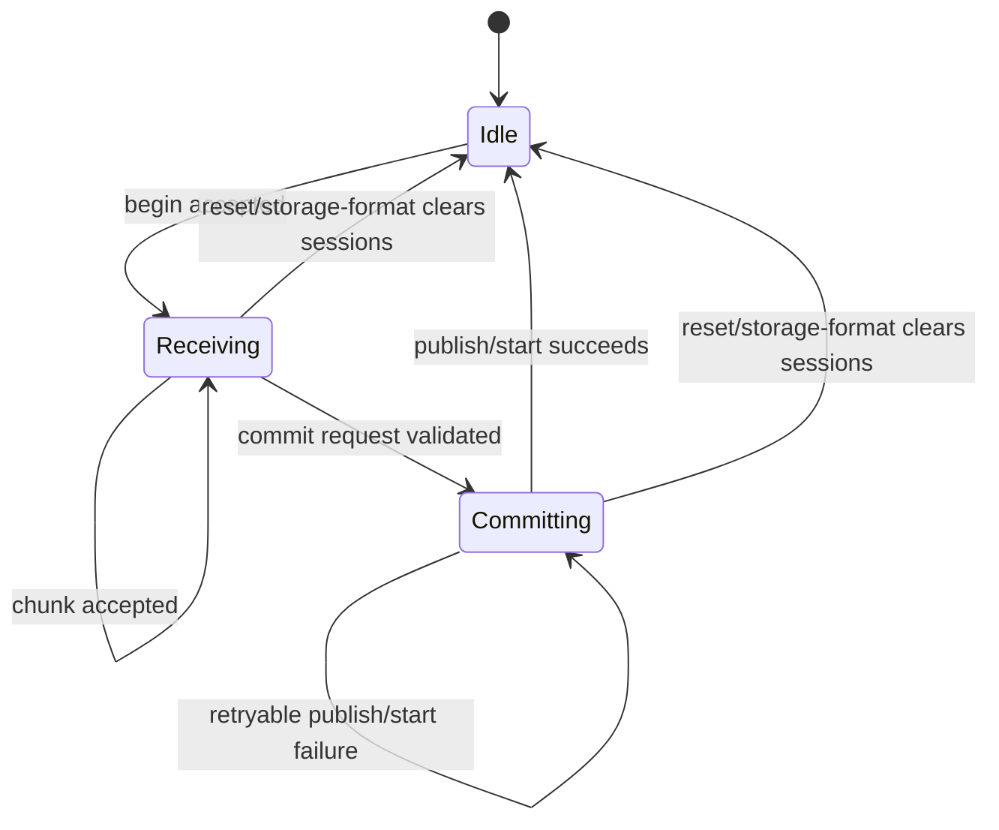
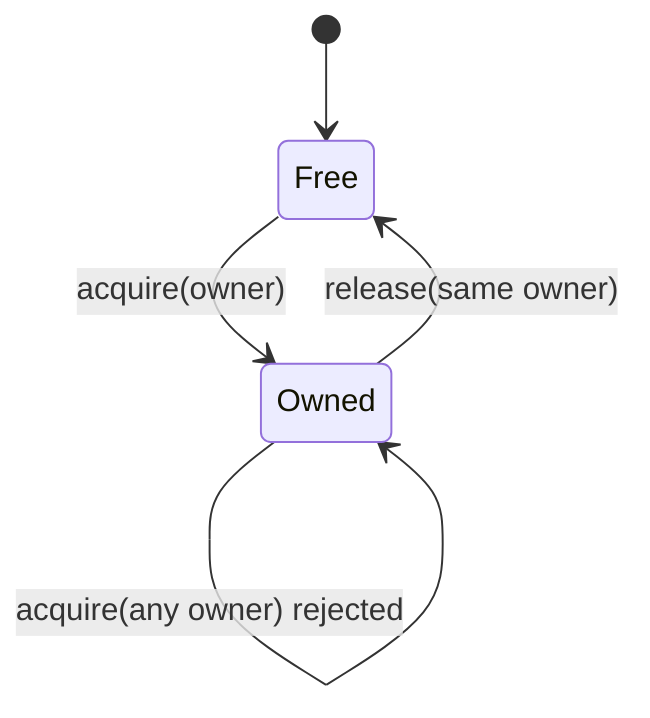
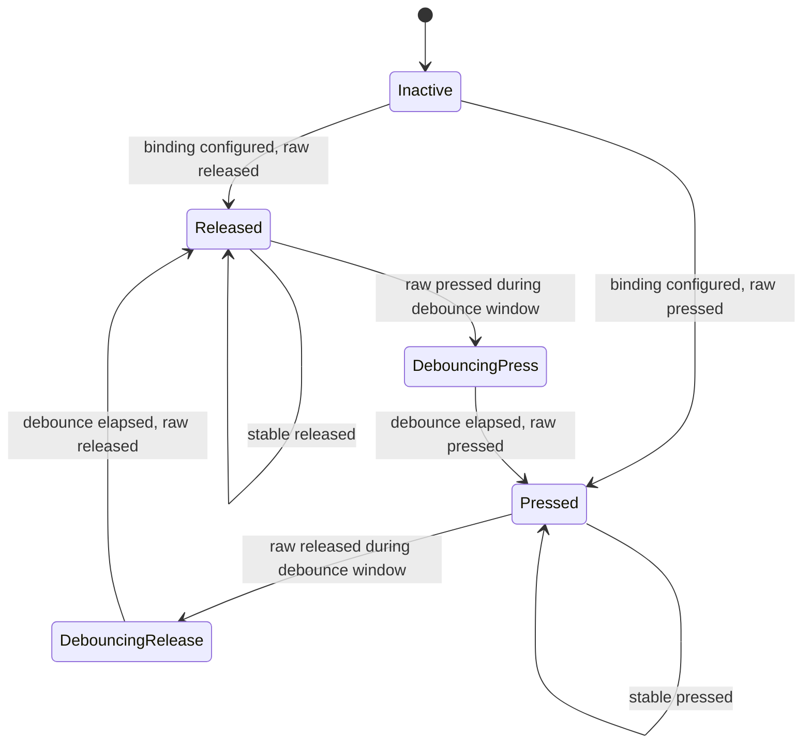
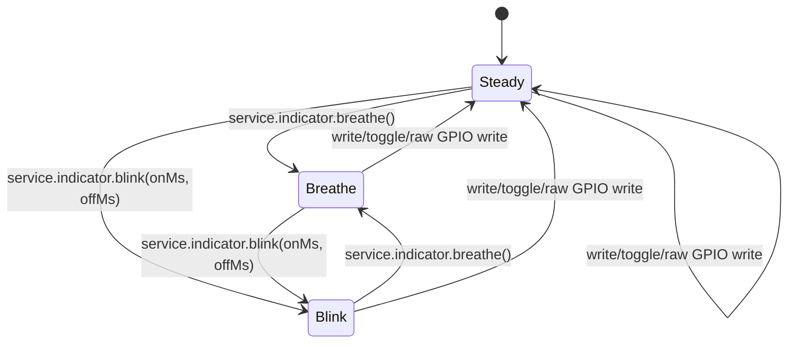

# Firmware State Machines

This document describes explicit firmware state machines that support
SquidScript runtime and device-protocol behavior. The app foreground lifecycle
is defined separately in `docs/app_lifecycle_state_machine.md`; this document
covers lower-level firmware states that must remain observable, bounded, and
testable.

## Protocol Transfer Sessions

Installed app uploads, temporary app runs, and resource uploads use the same
session phases. The wire protocol remains begin/chunk/commit. Rust FFI helpers
validate TLV fields, lengths, offsets, CRC32, and commit readiness; Zephyr C
advances the explicit phase only after the corresponding storage operation has
been accepted.

Phase rules:

- `Idle` means no transfer is active.
- `Receiving` means begin was accepted and chunks may advance byte progress.
- `Committing` means the session has passed commit validation and is attempting
  the target action: publish installed SQBC, start a temp SQBC, or publish a
  resource file.
- Reset and storage-format paths clear active sessions back to `Idle`.
- The phase is firmware-local state. It does not change SQDP frame fields or
  host-visible upload chunk sizing.

## Protocol Scratch Ownership

Protocol scratch is a single bounded work area shared by maintenance commands
that need resumable progress. Scratch users must acquire ownership before
writing command-specific state and release the same owner when work completes
or is cancelled.

Ownership rules:

- Scratch can be acquired only while it is free.
- No owner can overlap an active scratch owner.
- A mismatched release is rejected and leaves the current owner intact.
- Runtime reset and storage-format cleanup paths release scratch before they
  begin new protocol work.

## Device Input Buttons

Device input buttons use a per-binding press/release debounce state machine.
The current portable behavior dispatches only press events; release is tracked
as state and does not dispatch an event.

Button rules:

- Runtime polling stays bounded and nonblocking.
- Input sampling and debounce continue while a foreground VM event is running.
- Press transitions enqueue logical events when the VM is busy, then dispatch
  queued events through the normal SquidScript runtime path when the VM becomes
  idle.
- The input event queue is bounded. When it is full, firmware drops the newest
  press event and records `input_queue_overflow` in device errors.
- Physical display refresh runs on a separate bounded worker; foreground event
  dispatch does not wait for the e-paper busy period before draining queued
  input events.
- Release transition updates the button phase only.
- Board GPIO polarity and pull configuration remain target-specific firmware
  details; the portable runtime observes logical pressed/released state.

## Indicator Patterns

The target indicator uses one pattern state machine instead of independent
blink and breathe flag clusters.

Pattern rules:

- `Steady` owns direct write/toggle/raw GPIO output.
- `Breathe` advances through the fixed duty-cycle table on bounded poll ticks.
- `Blink` alternates on/off brightness using the configured durations.
- Starting a new pattern replaces the previous pattern.
- Indicator polling is best-effort from the main runtime poll path; errors do
  not block unrelated protocol polling.

## App Upload Route And Staging

HTTP and BLE are producers for one app-owned upload route. The active
`service.upload` profile supplies accepted extensions, enabled transports, and
the completion event; both producers feed the same staged-file lifecycle.

| Phase | Trigger | Action | Outcome |
| --- | --- | --- | --- |
| Idle | — | No in-flight transfer; `app_install_file` and `app_install_app` idle | Ready for new transfer |
| Begin | Enabled producer supplies safe name + content size | Shared routing validates the transport and extension against the active foreground profile, rejects concurrent work as busy, and opens staging under firmware-owned `tmp/` | In-flight session active; staging file open |
| Content | HTTP body or BLE chunks arrive | Producer advances bounded chunks into storage and updates `bytesReceived`; HTTP resume may seek to the retained offset | Staging file grows without file-sized app RAM |
| Complete | Declared size is staged | Storage is finalized and the shared pending record receives app id, profile id, event, name, sizes, file ref, and transport | Poll path dispatches the configured completion event |
| Handler | Foreground VM handles completion | App copies, installs, or otherwise consumes `ev.upload`; `ev.transport` identifies the producer | Staging reference remains valid during dispatch |
| Cleanup | Handler returns | Shared cleanup removes the ephemeral staging file and clears pending/in-flight state | Idle |
| BLE abort / disconnect | BLE producer aborts or disconnects | Closes and removes staging; clears in-flight state; no event emitted | Idle |
| HTTP disconnect / timeout | HTTP body ends before the declared size | Closes the socket but retains the bounded stage metadata and current offset | Partial state is available to `HEAD` and exact `Content-Range` resume |
| Stop / Reset / StorageFormat | Runtime or device protocol handler | Aborts in-flight work, removes retained partial state, clears the active profile and producers; no event emitted | Idle; route inactive |

The producer/consumer handoff remains bounded and is drained by the main runtime
poll path. The completion handler must consume the caller-owned file reference
before it returns. `file.copy` publishes content into a logical library;
`app.install` validates SQBC metadata and publishes the installed app. Upload
cleanup never infers either action from the filename.

The native X4 BLE adapter preserves the custom GATT wire state machine and uses
a bounded producer/consumer handoff. The GATT task queues four fixed
192-byte chunk records, and a separate storage task performs one incremental
staging operation per queue item. A full queue delays the ATT write response,
providing protocol-level backpressure without host timing sleeps. Abort,
disconnect, route failure, and storage failure cancel the BLE session through a
separate control lane, delete the partial staging file, and invalidate already
queued chunks by session id. COMPLETE is emitted only after staging commit and
completion-event dispatch succeed. The HTTP adapter accepts `PUT` and `HEAD`
at `/upload/<safe-name>`, streams through a fixed chunk buffer, and retains a
bounded partial offset for `Content-Range` resume. Starting the HTTP transport
does not start Wi-Fi or an access point.

The native table includes the standard GATT Service Changed characteristic so
BlueZ and other caching clients do not retain an incomplete characteristic
tree across firmware updates. The GATT write path accepts both its indication
CCCD and the transfer-status notification CCCD.

Trouble Host connection-parameter requests are answered explicitly with the
peer-requested valid parameters. A failed response cancels any active transfer
and closes the connection instead of leaving the controller waiting for a
reply until its supervision timeout.

An accepted native X4 BLE connection also has an inactivity watchdog. GATT
events and outbound runtime status notifications reset it. If no such activity
occurs before `firmware.native.bleConnectionWatchdogMs` expires, firmware
cancels the current session through the storage control lane, drains stale
status notifications, drops the GATT connection so the controller sends a
clean disconnect request, and returns to advertising. Targets default to
30 seconds when the metadata field is absent. The watchdog is not a transfer
deadline: an active client can continue a larger transfer as long as protocol
activity continues.

## Bounded Queues

Trace lines, output lines, drawlog entries, and similar diagnostics are bounded
queues rather than state machines. They should stay simple FIFO-style buffers
unless a future feature introduces meaningful lifecycle phases, ownership, or
transitions that need validation.
