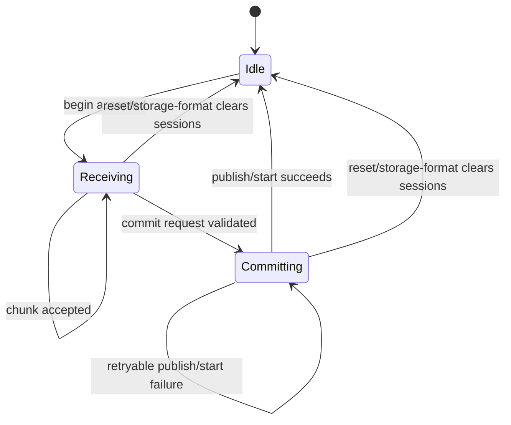
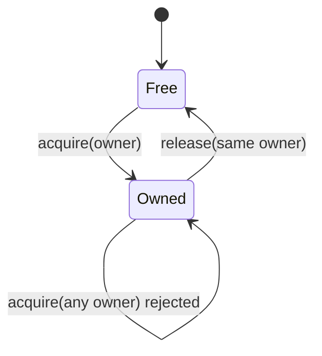
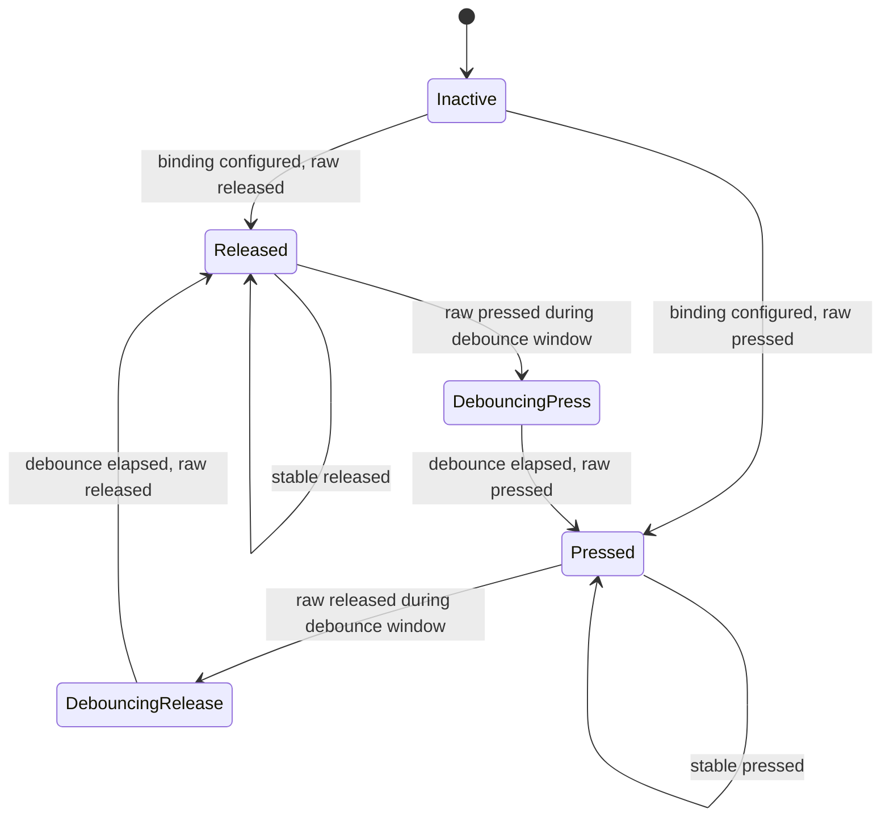
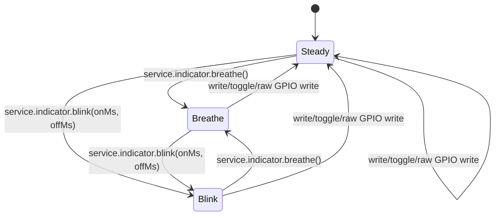

# Firmware State Machines

This document describes explicit firmware state machines that support
SquidScript runtime and device-protocol behavior. The app foreground lifecycle
is defined separately in `docs/app_lifecycle_state_machine.md`; this document
covers lower-level firmware states that must remain observable, bounded, and
testable.

## Protocol Transfer Sessions

Installed app uploads, temporary app runs, and resource uploads use the same
session phases. The wire protocol remains begin/chunk/commit. Rust FFI helpers
validate TLV fields, lengths, offsets, CRC32, and commit readiness; Zephyr C
advances the explicit phase only after the corresponding storage operation has
been accepted.

Phase rules:

- `Idle` means no transfer is active.
- `Receiving` means begin was accepted and chunks may advance byte progress.
- `Committing` means the session has passed commit validation and is attempting
  the target action: publish installed SQBC, start a temp SQBC, or publish a
  resource file.
- Reset and storage-format paths clear active sessions back to `Idle`.
- The phase is firmware-local state. It does not change SQDP frame fields or
  host-visible upload chunk sizing.

## Protocol Scratch Ownership

Protocol scratch is a single bounded work area shared by maintenance commands
that need resumable progress. Scratch users must acquire ownership before
writing command-specific state and release the same owner when work completes
or is cancelled.

Ownership rules:

- Scratch can be acquired only while it is free.
- No owner can overlap an active scratch owner.
- A mismatched release is rejected and leaves the current owner intact.
- Runtime reset and storage-format cleanup paths release scratch before they
  begin new protocol work.

## Device Input Buttons

Device input buttons use a per-binding press/release debounce state machine.
The current portable behavior dispatches only press events; release is tracked
as state and does not dispatch an event.

Button rules:

- Runtime polling stays bounded and nonblocking.
- Input polling is skipped while a foreground VM event is running.
- Press transition dispatches the configured logical event through the normal
  SquidScript runtime path.
- Release transition updates the button phase only.
- Board GPIO polarity and pull configuration remain target-specific firmware
  details; the portable runtime observes logical pressed/released state.

## Indicator Patterns

The target indicator uses one pattern state machine instead of independent
blink and breathe flag clusters.

Pattern rules:

- `Steady` owns direct write/toggle/raw GPIO output.
- `Breathe` advances through the fixed duty-cycle table on bounded poll ticks.
- `Blink` alternates on/off brightness using the configured durations.
- Starting a new pattern replaces the previous pattern.
- Indicator polling is best-effort from the main runtime poll path; errors do
  not block unrelated protocol polling.

## Bounded Queues

Trace lines, output lines, drawlog entries, and similar diagnostics are bounded
queues rather than state machines. They should stay simple FIFO-style buffers
unless a future feature introduces meaningful lifecycle phases, ownership, or
transitions that need validation.
